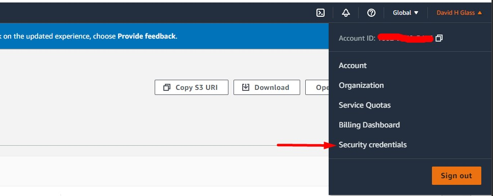
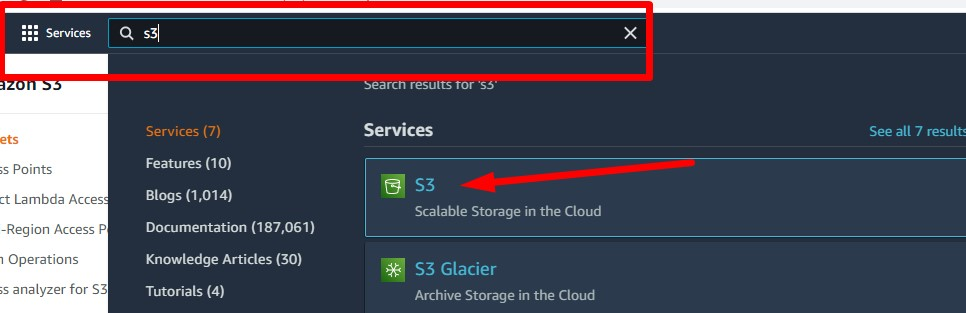
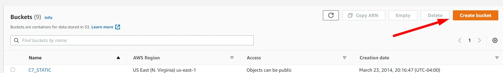
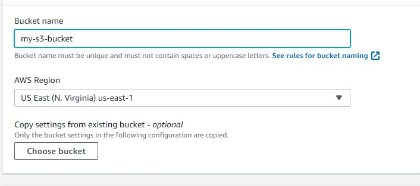
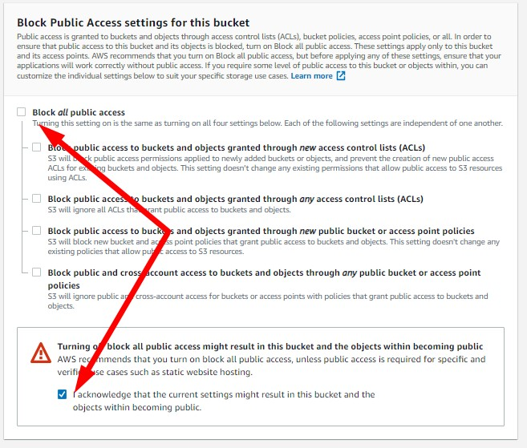
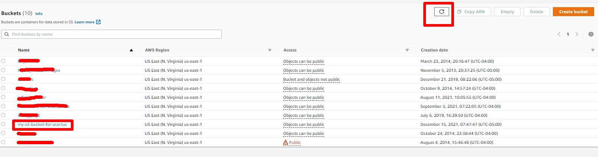
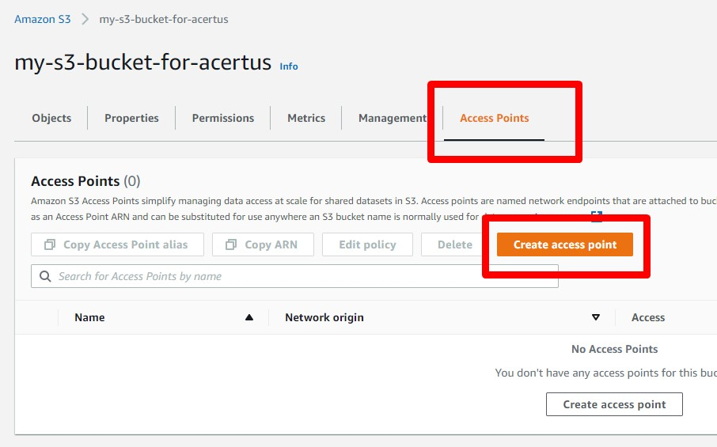
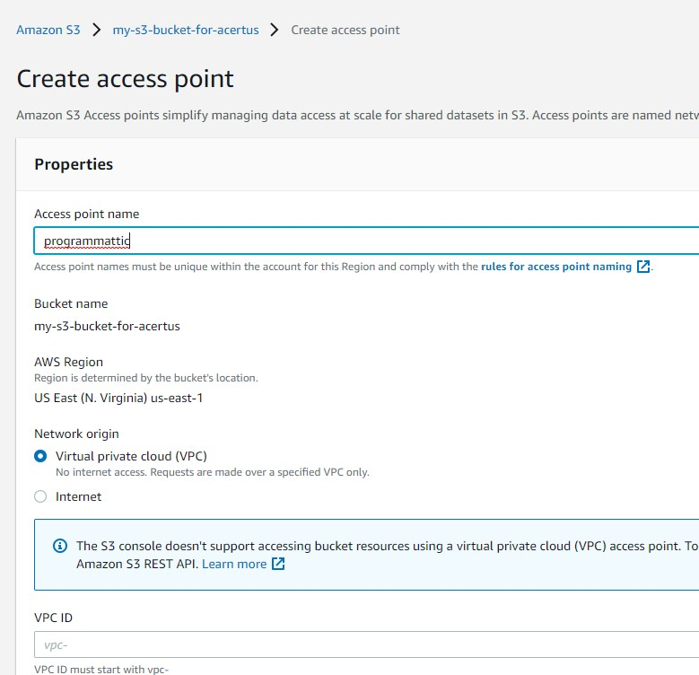

# S3 Image Upload Service
This service abstacts file uploads to S3 and adds image processing for thumbnail retrieval

<br/>

## Image Upload
To upload an image, use the the root POST method as a multipart-form-data post with the following form-data fields:

### asset
: This is the asset name as it will be stored in S3. If left blank, the original file name will be used instead. It is important to note that when overriding the file name with the asset field 

**IMPORTANT:** The file extension should be specified with the asset name as it is still used to determine the mime-type to be used by the client application

<br/>

### folder
: This is used to simulate a folder structure in S3. Together with the file name or asset name, they will be stored in the s3 bucket as follows

`<folder>/<asset | file name>`

```
POST http://<host> 

```

<br/>

## Image Download (render)
To retrieve the image, simply use the root get request as follows
```
GET http://<host>/folder=<folder>&asset=<asset name>
```

Optionally, if an asset is an image (.jpg, .png or .gif) you may use the `maxsize` parameter to set the max height or max width of an image, conserving its dimensions, so it may be retrieved and rendered as a thumbnail

---

<br/>

## Project Setup (local)
This project relies environment variables to connect to AWS services such as S3, and to determine which bucket to upload to; to run on your local, this will require a `.env` file which is ignored by git to prevent sensitive information, such ass application access keys and secrets from being distributed. A sample environment file (`.devenv`) has been provided in this project containing only the field names

1. Rename `.devenv` to `.env`
2. Populate `AWS_ACCESS_KEY_ID` and `AWS_SECRET_ACCESS_KEY` by going to the AWS console, 


Navigate to Security Credentials


Create an access key (unless you have a key/value pair already)


**Note**: If you already have an access key and don't know it's secret, you will have to create another one. If you already have 2, you will have to delete one

3. Copy the access key ID and the access key secret to the settings in the .env file
```

AWS_ACCESS_KEY_ID=<your access key ID here>
AWS_SECRET_ACCESS_KEY=<your access key secret here>
AWS_PUBLIC_BUCKET_NAME=

```
4. Create an AWS S3 Bucket 
<br/>
**Note** If you already have an S3 bucket, skip to step 5

<mark>**Note**: We're going to set up a public bucket to get things moving. I never tested this in a private bucket due to time constraints, but we're going to have to get to that before moving to production</mark>

From the AWS console, navigate to s3



Click on "Create Bucket"



Enter values for Bucket Name and Region



Disable Block *all* public access <mark>We'll be testing against private buckets in the future</mark>



Click on "Create Bucket"

Once the buckets list appears, you might need to refresh the list to reveal the newly created bucket



5. Create an Access Point for the bucket

Click on the bucket name, then on the "Access Points" tab and "Create Access Point"



Fill the values for the access point



Click on "Create Access Point" to create

6. Go to the bucket's access point's Properties tab and click on the ARN's copy link


Enter the ARN value in your .env file

```

AWS_ACCESS_KEY_ID=<your access key ID here>
AWS_SECRET_ACCESS_KEY=<your access key secret here>
AWS_PUBLIC_BUCKET_NAME=**<your copied ARN value>**

```

OK, now your ready to run the solution!

Open a terminal in the project's root directory and type

`npm install`

This will install all your project dependencies

Now run

`npm run dev:start`

Your solution should now be ready to receive requests on port 3001

Use the Postman collection supplied in the docs/collections folder to upload and retrieve files to/from S3

Happy Coding! 

:joy:

TODO
- [*] Test with encryption at rest on S3 buckets
- [ ] Test with private S3 buckets
- [ ] Test with assets such as .txt, .docx, etc
- [ ] Containerize
- [ ] Create project CDK